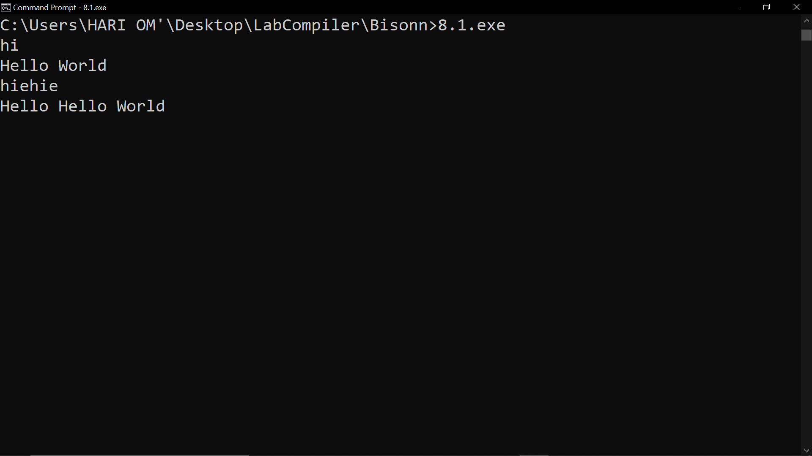
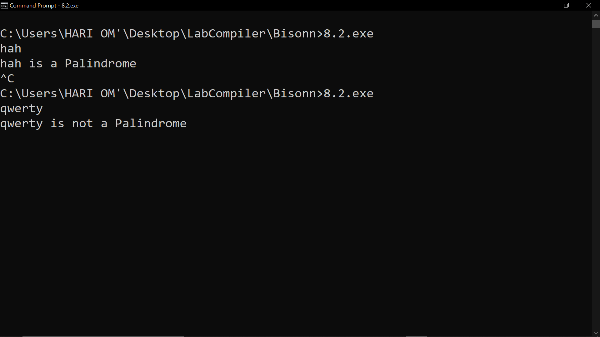

# Output

- ### Problem 8.1

      Write a program using Lex and YACC to respond to the entered Input.

  

---

- ### Problem 8.2

      Write a program using Lex and YACC to check whether a string is Palindrome or Not.

   
